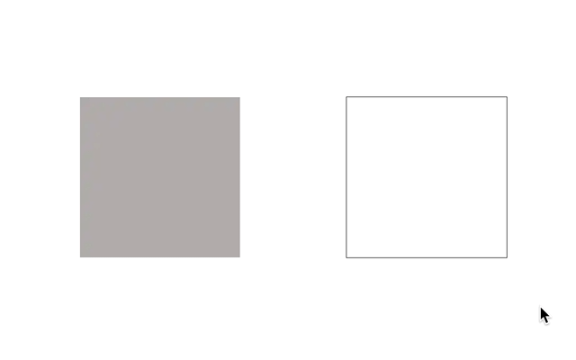
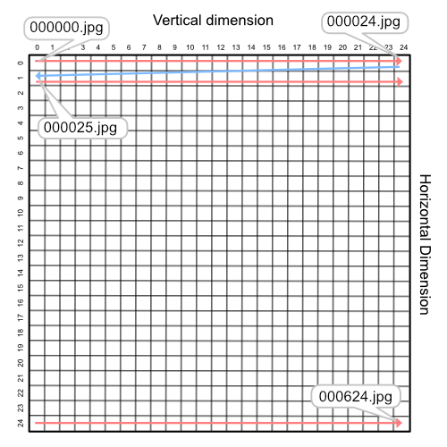
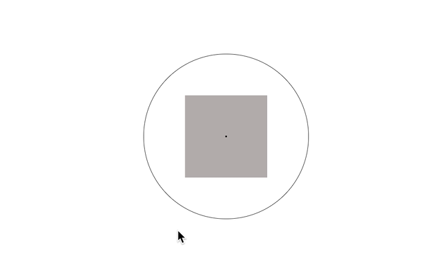

# Mouse reconstruction plugins for jsPsych
This repository contains two jsPsych custom plugins ('plugin-reconstruct-2D' & 'plugin-reconstruct-circle') where participants can reconstruct their responses by adjusting the mouse position in the continuous probe space.
You can also record 'confidence intervals' of the responses after participants finalize their initial reconstruction responses. 

## Plugin-reconstruction-2D
This plugin allows a participant to interact with a stimulus by moving the mouse position inside of the "2 dimensional" stimulus space.

### Demo


### Stimulus Praparation
To use this plugin, you need to prepare an image set that consists of your stimulus space. 
For example, if your stimulus space is 25 x 25 (vertical x horizontal step sizes), a total of 625 images should be prepared and indexed properly from 000000 ~ 000625. 
The indices of the images start from top-left of the space and move along the vertical direction. Note that each image should be named with its index with leading zeroes of 6 (e.g., top-left image: 000000.jpg).  



### Usage/Example
Basically, the usage follows the ordinary jsPsych 7+ framework. Specifically for this plugin..

1. Load the plugin file in the html head section 
```html
<head>
  <script src="plugin-reconstruction-2D.js"></script>
</head>
```
2. Creat a trial using the plugin. (Details of possible paramters are in coming section...)
```html
<script>
  
var reconstruction = {
    type: jsPsychReconstruction_2D,
    horizontal_step_size: 25,
    vertical_step_size: 25, 
    image_path: 'YOUR IMAGE PATH',
    uncertainty_range: true
}
  
</script>
```
### Parameters
|     Paramter     | Type   | Default value |                Description                |
| ---------------- | ------ | ------------- |-------------------------------------------|
| image_position   | string | 'left'        | Position of the probe image on the screen |
| canvas_position  | string | 'right'       | Position of the probe space on the screen |
| horizontal_step_size| integer| undefined | Step size of horizontal dimension|
| vetical_step_size | integer| undefined| Step size of vertical dimension|
| image_path | string|undefined| Path to the image directory|
| image_width | integer| 300 | Width of image in a pixel unit|
| image_height | integer| 300 | Height of image in a pixel unit|
| image_format | string | '.jpg' | Format (extension) of image file. (e.g., '.png', '.webp', etc) |
| starting_value| integer | 999999| Indext of initial image before moving the mouse. By default, it's set to 999999, which indicates an additional grey image named 999999.jpg (or any extention). So, in case you like to use grey image as a initial image, please include a grey image in your image path.|
| canvas_shape | string| 'rectangle'| Shape of the probe space. Another option is 'circle.' If you set this paramter as 'circle', the probe space has circular bordeer, and the dimensional structure will be less noticable for participants.|
| canvas_width  | integer| 300 | Width of the probe space in a pixel unit|
| canvas_height | integer| 300 | Height of the probe space in a pixel unit|
| canvas_diameter| integer| 300 | Diamter of the circle probe space. If you change 'canvas_shape' to 'circle', you can adjust this paramter.|
| canvas_border_width| integer| 1| Border width of the probe space in a pixel unit.|
| uncertainty_range |boolian | false | If you want to record confidence range of the reconstruction, change this paramter as true.|

### Data generated
|         Name     | Type   | Value              |
| ---------------- | ------ | ------------------ |
| response         | integer| Index of the image that a participant responded by clicking. |
|search_rt| numeric| Response time taken until a participant responded (from a trial started to initial click). |
|uncertainty_radius| numeric| Radius of the confidence range. This will be generated only when 'uncertainty_range' set as true.|
|uncertainty_rt |numeric |Response time taken until confidence range responded (from the initial search completed to range click). |

## Plugin-reconstruction-circle
This plugin allows a participant to interact with a stimulus by moving the mouse position along a "circular" stimulus space.



### Stimulus Praparation

### Usage/Example

### Parameters

### Data generated


