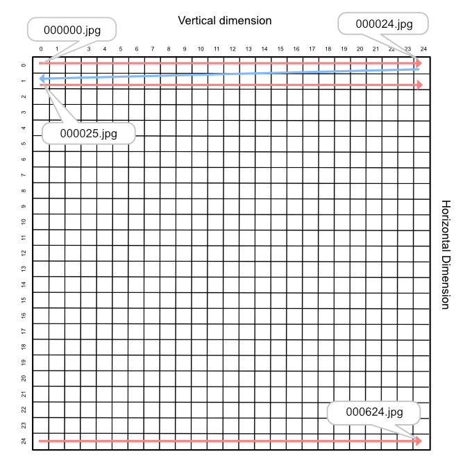
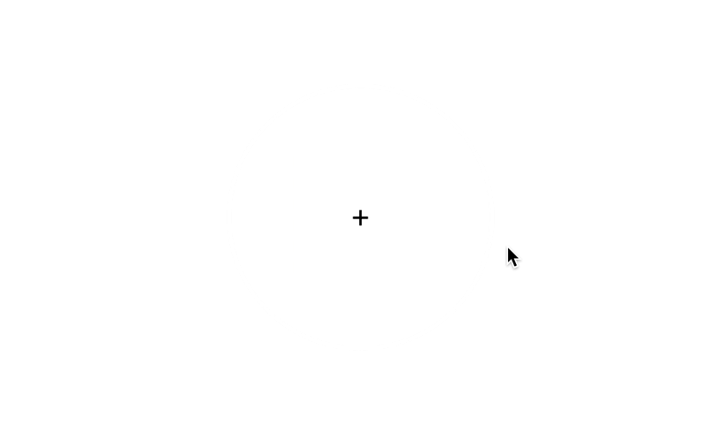

# Mouse reconstruction plugins for jsPsych
This repository contains two jsPsych custom plugins ('plugin-reconstruct-2D' & 'plugin-reconstruct-wheel') where participants can reconstruct their responses by adjusting the mouse position in the interactive probe space.
You can also record 'confidence intervals' of the responses after participants finalize their initial reconstruction responses. 


## Plugin-reconstruction-2D
This plugin allows a participant to interact with a stimulus by moving the mouse position inside of the "2-dimensional" stimulus space.

### Demo


### Stimulus Praparation
To use this plugin, you need to prepare an image set that consists of your stimulus space. 
For example, if your stimulus space is 25 x 25 (vertical x horizontal step sizes), a total of 625 images should be prepared and indexed properly from 000000 ~ 000625. 
The indices of the images start from the top-left of the space and move along the vertical direction. Note that each image should be named with its index with leading zeroes of 6 (e.g., top-left image: 000000.jpg).  



### Usage/Example
The usage of this plugin follows the ordinary jsPsych 7 framework. Specifically for this plugin,

1. Load the plugin file in the html head section 
```html
<head>
  <script src="plugin-reconstruction-2D.js"></script>
</head>
```
2. Creat a trial using the plugin. (Details of possible parameters are in the following section.)
```html
<script>
  
var reconstruction = {
    type: jsPsychReconstruction_2D,
    horizontal_step_size: 25,
    vertical_step_size: 25, 
    image_path: 'YOUR IMAGE PATH',
    uncertainty_range: true
}
  
</script>
```
### Parameters
|     Paramter     | Type   | Default value |                Description                |
| ---------------- | ------ | ------------- |-------------------------------------------|
| image_position   | string | 'left'        | Position of the probe image on the screen |
| canvas_position  | string | 'right'       | Position of the probe space on the screen |
| horizontal_step_size| integer| undefined | Step size of the horizontal dimension|
| vetical_step_size | integer| undefined| Step size of the vertical dimension|
| image_path | string|undefined| Path to the stimulus folder|
| image_width | integer| 300 | Width of the image in a pixel unit|
| image_height | integer| 300 | Height of the image in a pixel unit|
| image_format | string | 'jpg' | Format (extension) of the image file. (e.g., 'png', 'webp', etc) |
| starting_value| integer | 999999| Index of the initial image before moving the mouse. By default, it's set to 999999, which indicates an additional grey image named 999999.jpg (or any extension). So, in case you like to use the grey image as a starting image, please include a grey image in your stimulus folder.|
| canvas_shape | string| 'rectangle'| Shape of the probe space. Another option is 'circle.' If you set this parameter as 'circle', the probe space will be restricted into a circular shape, and so the dimensional structure will be less noticeable for participants.|
| canvas_width  | integer| 300 | Width of the probe space in a pixel unit|
| canvas_height | integer| 300 | Height of the probe space in a pixel unit|
| canvas_diameter| integer| 300 | Diameter of the circle probe space. If you change 'canvas_shape' to 'circle', you can adjust this parameter.|
| canvas_border_width| integer| 1| Border width of the probe space in a pixel unit.|
| uncertainty_range |boolean | false | If you want to record the confidence range of the reconstruction, change this parameter as true.|

### Data generated
|         Name     | Type   | Value              |
| ---------------- | ------ | ------------------ |
| response         | integer| Index of the image that a participant responded to by clicking. |
|search_rt| numeric| Response time taken until a participant responded (from a trial started to initial click). |
|uncertainty_radius| numeric| Radius of the confidence range. This will be generated only when 'uncertainty_range' is set as true.|
|uncertainty_rt |numeric |Response time taken until confidence range responded (from the initial search completed to range click). |


## Plugin-reconstruction-wheel
This plugin allows a participant to interact with a stimulus by moving the mouse position along a "circular" stimulus space.



### Stimulus Praparation
To use this plugin, you need to prepare an image set that consists of your circular stimulus space. For example, if you like to use 1 degree step size along the full circle, you need to prepare 360 images, and index them from 000000 to 000360. 

### Usage/Example
1. Load the plugin file in the html head section 
```html
<head>
  <script src="plugin-reconstruction-circle.js"></script>
</head>
```
2. Creat a trial using the plugin. (Details of possible parameters are in the following section.)
```html
<script>
  
var recon = {
    type: jsPsychReconstruction_wheel,
    image_path: 'wheel00_r16',
    image_format: 'webp',
    uncertainty_range: true
}
  
</script>
```

### Parameters
|     Paramter     | Type   | Default value |                Description                |
| ---------------- | ------ | ------------- |-------------------------------------------|
| image_path       | string | undefined     | Path to the stimulus folder               |
| image_width | integer| 200 | Width of the image in a pixel unit|
| image_height | integer| 200 | Height of the image in a pixel unit|
| image_format | string | 'jpg' | Format (extension) of the image file. (e.g., 'png', 'webp', etc) |
| show_answer | boolean | false | You can change this parameter as true for the perceptual reconstruction task. It will display a target image and reconstruction canvas at the same time. |
| answer_image | integer | null | Index of a target image. Use this parameter when 'show_answer' is set as true.|
| answeer_image_width | integer| 200 | Width of the target image in a pixel unit|
| answer_image_height | integer| 200 | Height of the target image in a pixel unit|
| step_size| integer | 1 | Polar angle between adjacent images on the wheel in a degree unit |
| show_indicator | boolean | true| This parameter determines whether or not to show a circular indicator indicating the polar angle of the mouse pointer.|
| indicator_wheel_diameter | integer | 400 | Diameter of indicator wheel in a pixel unit|
| indicator_wheel_width | integer | 2 | Width of the indicator wheel border|
| indicator_pointer_radius | integer |4| Radius of indicator pointer for the polar angle of the mouse.|
| canvas_position | string | center | Position of the reconstruction canvas. If you use the 'show_answer' parameter, change the position of the canvas to 'left', 'right', 'top', or 'bottom' depending on your design.|
|answer_position| string | null | Position of the answer image. If you use the 'show_answer' parameter, change the position of the canvas to 'left', 'right', 'top', or 'bottom' depending on your design.|
| random_circle_rotation |boolean| false| Randomizing the starting point of the wheel.|
|starting_value| integer| 999999| Index of the initial image before moving the mouse. By default, it's set to 999999, which indicates an additional grey image named 999999.jpg (or any extension). So, in case you like to use the grey image as a starting image, please include a grey image in your stimulus folder.|
| uncertainty_range |boolean | false | If you want to record the confidence range of the reconstruction, change this parameter as true.|

### Data generated
|         Name     | Type   | Value              |
| ---------------- | ------ | ------------------ |
| response         | integer| Index of the image that a participant responded to by clicking. |
|search_rt| numeric| Response time taken until a participant responded (from a trial started to initial click). |
|mouse_angle| numeric | Polar angle of mouse pointer where participant responded. |
|uncertainty_half_range| numeric| Half of the confidence range in degree unit. This will be generated only when 'uncertainty_range' is set as true.|
|uncertainty_rt |numeric |Response time taken until confidence range responded (from the initial search completed to range click). |


